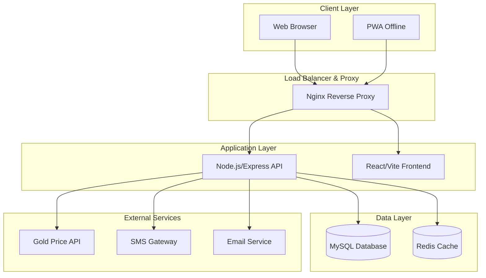
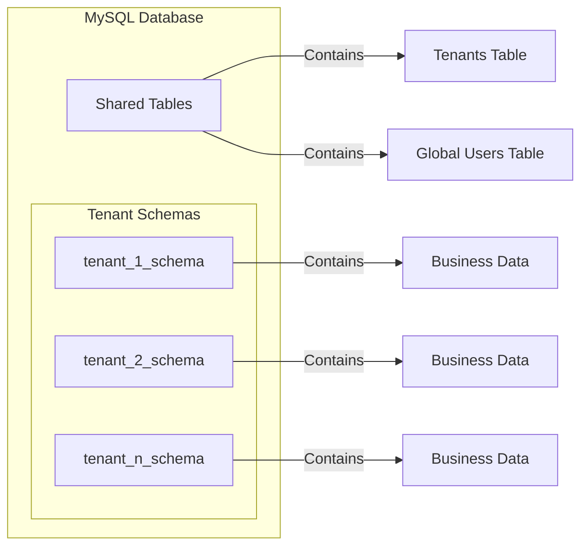
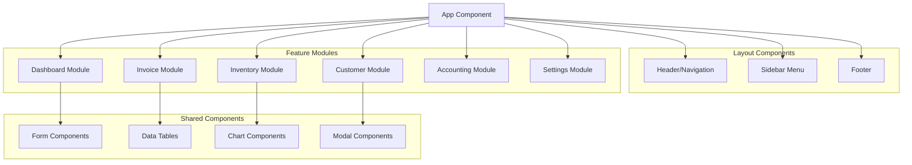
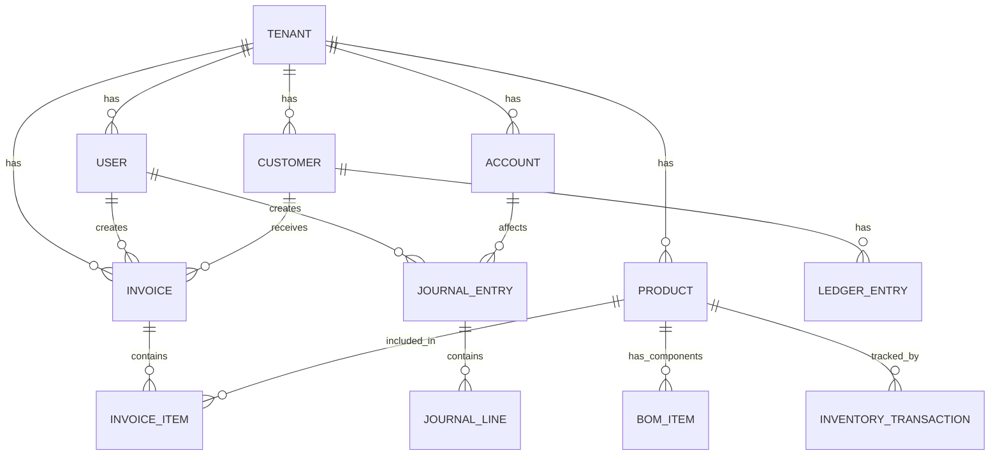

# Design Document

## Overview

The Jewelry SaaS Platform is designed as a modern, scalable multi-tenant application built with a microservices-oriented architecture. The platform leverages Node.js/Express.js for the backend API, React.js with Vite for the frontend, MySQL with Prisma ORM for data persistence, and Redis for caching and session management. The entire system is containerized using Docker for consistent deployment and development environments.

The architecture prioritizes tenant isolation, security, performance, and maintainability while providing a rich, RTL-compliant Persian user interface optimized for jewelry business workflows.

## Architecture

### High-Level Architecture



### Multi-Tenant Data Architecture

The platform implements tenant isolation using a **separate schema per tenant** approach within a shared MySQL database instance. This provides strong data isolation while maintaining operational efficiency.



### Technology Stack

- **Backend**: Node.js 18+ with Express.js and TypeScript
- **Frontend**: React 18+ with Vite, TypeScript, and Tailwind CSS
- **Database**: MySQL 8.0 with Prisma ORM
- **Caching**: Redis 7.0 for sessions, rate limiting, and KPI caching
- **Authentication**: JWT tokens with refresh token rotation
- **File Storage**: Local file system with configurable cloud storage support
- **Containerization**: Docker with Docker Compose for development
- **CI/CD**: GitHub Actions for automated testing and deployment

## Components and Interfaces

### Core Backend Services

#### 1. Authentication Service
- **Purpose**: Handles user authentication, authorization, and session management
- **Key Features**:
  - JWT token generation and validation
  - Two-factor authentication (2FA)
  - Session device tracking
  - Password policy enforcement
  - Rate limiting and brute force protection

#### 2. Tenant Management Service
- **Purpose**: Manages tenant lifecycle, schema provisioning, and isolation
- **Key Features**:
  - Tenant registration and setup
  - Schema creation and migration
  - Tenant-specific configuration management
  - Subscription and billing integration

#### 3. Business Logic Services

##### Invoice Service
- **Purpose**: Handles all invoicing operations with gold pricing calculations
- **Key Features**:
  - Multi-type invoice support (Sale, Purchase, Trade)
  - Dynamic gold pricing integration
  - PDF generation with custom branding
  - Recurring invoice automation
  - Multi-currency support

##### Inventory Service
- **Purpose**: Manages product catalog and stock tracking
- **Key Features**:
  - Multi-category product management
  - Real-time stock updates
  - BOM (Bill of Materials) support
  - Barcode/QR code generation
  - Wastage tracking

##### Customer Service
- **Purpose**: Comprehensive CRM functionality
- **Key Features**:
  - Customer profile management
  - Ledger and balance tracking
  - Communication integration (SMS/WhatsApp)
  - Customer grouping and segmentation
  - Credit limit enforcement

##### Accounting Service
- **Purpose**: Double-entry bookkeeping and financial reporting
- **Key Features**:
  - Chart of accounts management
  - Journal entry processing
  - Financial report generation
  - Multi-currency ledger support
  - Audit trail maintenance

#### 4. Integration Services

##### External API Service
- **Purpose**: Manages external service integrations
- **Key Features**:
  - Gold price API integration
  - SMS/Email gateway integration
  - Webhook management
  - Third-party API rate limiting

##### Notification Service
- **Purpose**: Handles all system notifications and communications
- **Key Features**:
  - Real-time WebSocket notifications
  - Email template processing
  - SMS automation
  - Push notification support

### Frontend Architecture

#### Component Structure



#### State Management
- **Global State**: Redux Toolkit for application-wide state
- **Server State**: React Query for API data caching and synchronization
- **Form State**: React Hook Form for form management
- **Local State**: React useState for component-specific state

#### RTL and Internationalization
- **RTL Support**: CSS-in-JS with automatic RTL transformation
- **Text Direction**: Automatic detection and application of text direction
- **Number Formatting**: Persian and English digit support
- **Date Formatting**: Persian calendar integration with Gregorian fallback

## Data Models

### Core Entity Relationships



### Key Data Models

#### Tenant Model
```typescript
interface Tenant {
  id: string;
  name: string;
  subdomain: string;
  schema_name: string;
  subscription_plan: SubscriptionPlan;
  settings: TenantSettings;
  created_at: Date;
  updated_at: Date;
  is_active: boolean;
}
```

#### User Model
```typescript
interface User {
  id: string;
  tenant_id: string;
  email: string;
  password_hash: string;
  role: UserRole;
  permissions: Permission[];
  two_factor_enabled: boolean;
  last_login: Date;
  created_at: Date;
  updated_at: Date;
  is_active: boolean;
}
```

#### Invoice Model
```typescript
interface Invoice {
  id: string;
  tenant_id: string;
  invoice_number: string;
  type: InvoiceType; // SALE, PURCHASE, TRADE
  customer_id: string;
  subtotal: Decimal;
  tax_amount: Decimal;
  total_amount: Decimal;
  currency: string;
  status: InvoiceStatus;
  payment_terms: PaymentTerms;
  items: InvoiceItem[];
  created_by: string;
  created_at: Date;
  updated_at: Date;
}
```

#### Product Model
```typescript
interface Product {
  id: string;
  tenant_id: string;
  sku: string;
  name: string;
  category: ProductCategory; // RAW_GOLD, JEWELRY, COINS, STONES
  weight: Decimal;
  purity: number; // for gold items
  manufacturing_cost: Decimal;
  current_stock: number;
  minimum_stock: number;
  bom_items: BOMItem[];
  barcode: string;
  created_at: Date;
  updated_at: Date;
}
```

#### Customer Model
```typescript
interface Customer {
  id: string;
  tenant_id: string;
  name: string;
  contact_info: ContactInfo;
  tax_id: string;
  customer_group: CustomerGroup;
  credit_limit: Decimal;
  current_balance: Decimal;
  tags: string[];
  created_at: Date;
  updated_at: Date;
}
```

#### Account Model (Chart of Accounts)
```typescript
interface Account {
  id: string;
  tenant_id: string;
  code: string;
  name: string;
  type: AccountType; // ASSET, LIABILITY, EQUITY, REVENUE, EXPENSE
  parent_id?: string;
  is_active: boolean;
  created_at: Date;
  updated_at: Date;
}
```

### Database Schema Design Principles

1. **Tenant Isolation**: Every business table includes `tenant_id` with database-level constraints
2. **Audit Trail**: All tables include `created_at`, `updated_at`, and `created_by` fields
3. **Soft Deletes**: Critical business data uses soft deletion with `deleted_at` timestamps
4. **Indexing Strategy**: Composite indexes on `(tenant_id, frequently_queried_fields)`
5. **Data Integrity**: Foreign key constraints within tenant boundaries
6. **Performance**: Partitioning large tables by tenant_id for improved query performance

## Error Handling

### Error Classification

#### 1. Client Errors (4xx)
- **400 Bad Request**: Invalid input data, validation failures
- **401 Unauthorized**: Authentication required or failed
- **403 Forbidden**: Insufficient permissions for requested operation
- **404 Not Found**: Resource not found within tenant scope
- **409 Conflict**: Business rule violations, duplicate data
- **422 Unprocessable Entity**: Valid syntax but semantic errors

#### 2. Server Errors (5xx)
- **500 Internal Server Error**: Unexpected application errors
- **502 Bad Gateway**: External service integration failures
- **503 Service Unavailable**: Temporary service outages
- **504 Gateway Timeout**: External service timeout

### Error Response Format

```typescript
interface ErrorResponse {
  error: {
    code: string;
    message: string;
    details?: any;
    timestamp: string;
    request_id: string;
    tenant_id?: string;
  };
}
```

### Error Handling Strategy

#### Backend Error Handling
1. **Global Error Middleware**: Catches and formats all unhandled errors
2. **Validation Middleware**: Validates request data using Joi schemas
3. **Business Logic Errors**: Custom error classes for domain-specific errors
4. **Database Errors**: Prisma error transformation and logging
5. **External Service Errors**: Retry logic with exponential backoff
6. **Logging**: Structured logging with correlation IDs for error tracking

#### Frontend Error Handling
1. **Error Boundaries**: React error boundaries for component-level error catching
2. **API Error Handling**: Centralized error handling in API client
3. **User Feedback**: Toast notifications and error messages in Persian
4. **Retry Logic**: Automatic retry for transient errors
5. **Offline Handling**: Graceful degradation when offline
6. **Error Reporting**: Optional error reporting to monitoring service

### Monitoring and Alerting

1. **Application Metrics**: Response times, error rates, throughput
2. **Business Metrics**: Invoice processing, user activity, system usage
3. **Infrastructure Metrics**: Database performance, Redis usage, server resources
4. **Alert Thresholds**: Configurable alerts for critical system events
5. **Health Checks**: Endpoint monitoring for all critical services

## Testing Strategy

### Testing Pyramid

#### 1. Unit Tests (70%)
- **Backend**: Jest for service layer and utility functions
- **Frontend**: Jest + React Testing Library for components
- **Coverage Target**: 80% code coverage minimum
- **Focus Areas**: Business logic, calculations, data transformations

#### 2. Integration Tests (20%)
- **API Integration**: Supertest for endpoint testing
- **Database Integration**: Test database with realistic data
- **External Service Mocking**: Mock external APIs and services
- **Multi-tenant Testing**: Verify tenant isolation

#### 3. End-to-End Tests (10%)
- **Critical User Journeys**: Invoice creation, customer management, accounting workflows
- **Cross-browser Testing**: Chrome, Firefox, Safari, Edge
- **Mobile Responsiveness**: Touch interactions and responsive layouts
- **RTL Layout Testing**: Verify proper RTL rendering

### Testing Environment Setup

#### Test Data Management
1. **Seed Data**: Consistent test data across environments
2. **Factory Pattern**: Generate test objects with realistic data
3. **Tenant Isolation**: Separate test tenants for parallel testing
4. **Data Cleanup**: Automatic cleanup after test execution

#### Continuous Integration
1. **Automated Testing**: Run full test suite on every commit
2. **Parallel Execution**: Run tests in parallel for faster feedback
3. **Quality Gates**: Block deployment if tests fail or coverage drops
4. **Performance Testing**: Monitor test execution time and optimize

### Security Testing

1. **Authentication Testing**: Verify JWT token handling and session management
2. **Authorization Testing**: Test role-based access control
3. **Input Validation**: SQL injection, XSS, and other injection attacks
4. **Tenant Isolation**: Verify data cannot leak between tenants
5. **Rate Limiting**: Test API rate limiting and abuse prevention
6. **Penetration Testing**: Regular security audits and vulnerability assessments

This comprehensive design provides a solid foundation for building a scalable, secure, and maintainable jewelry SaaS platform that meets all the specified requirements while following modern software architecture best practices.